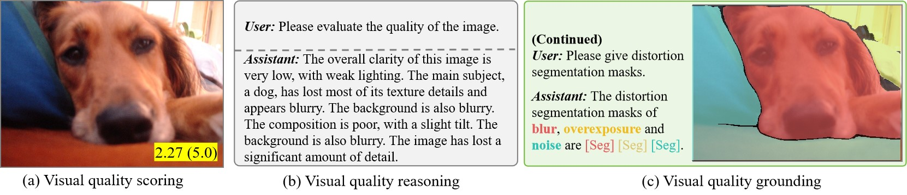

<div align="center">

## [Q-Ground: Image Quality Grounding with Large Multi-modality Models](https://arxiv.org/abs/2407.17035)

[<sup>1</sup>Chaofeng Chen](https://chaofengc.github.io), <sup>1</sup>Sensen Yang, [<sup>1</sup>Haoning Wu](https://teowu.github.io/), [<sup>1</sup>Liang Liao](https://liaoliang92.github.io/homepage/), [<sup>3</sup>Zicheng Zhang](https://zzc-1998.github.io/), [<sup>1</sup>AnnanWang](https://scholar.google.com/citations?user=vZn0gL8AAAAJ&hl=en),  [<sup>2</sup>Wenxiu Sun](https://scholar.google.com/citations?user=X9lE6O4AAAAJ&hl=en), [<sup>2</sup>Qiong Yan](https://scholar.google.com/citations?user=uT9CtPYAAAAJ&hl=en), [<sup>1</sup>Weisi Lin](https://personal.ntu.edu.sg/wslin/Home.html)  
<sup>1</sup>S-Lab, Nanyang Technological University, <sup>2</sup>Sensetime Research, <sup>3</sup>Shanghai Jiao Tong University

[](https://arxiv.org/abs/2407.17035) <a href="https://huggingface.co/datasets/chaofengc/QGround-100K"></a> -2B9370.svg) [](https://hits.seeyoufarm.com)

</div>



# TODO List

✅ Release datasets in 🤗Hugging Face [QGround-100K](https://huggingface.co/datasets/chaofengc/QGround-100K)   
⬜ Release test codes  
⬜ Release training codes  

# Citation

If you find this work useful, please consider to cite our paper:
```
@inproceedings{chen2024qground,
      title={Q-Ground: Image Quality Grounding with Large Multi-modality Models}, 
      author={Chaofeng Chen and Sensen Yang and Haoning Wu and Liang Liao and Zicheng Zhang and Annan Wang and Wenxiu Sun and Qiong Yan and Weisi Lin},
      Journal = {ACM International Conference on Multimedia},
      year={2024},
}
```

# Acknowledgement

This project is based on [PixelLM](https://github.com/MaverickRen/PixelLM), [LISA](https://github.com/dvlab-research/lisa) and [LLaVA](https://github.com/haotian-liu/LLaVA). Thanks to the authors for their great work!
